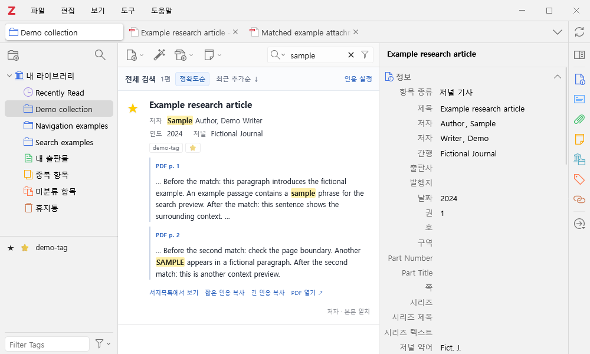
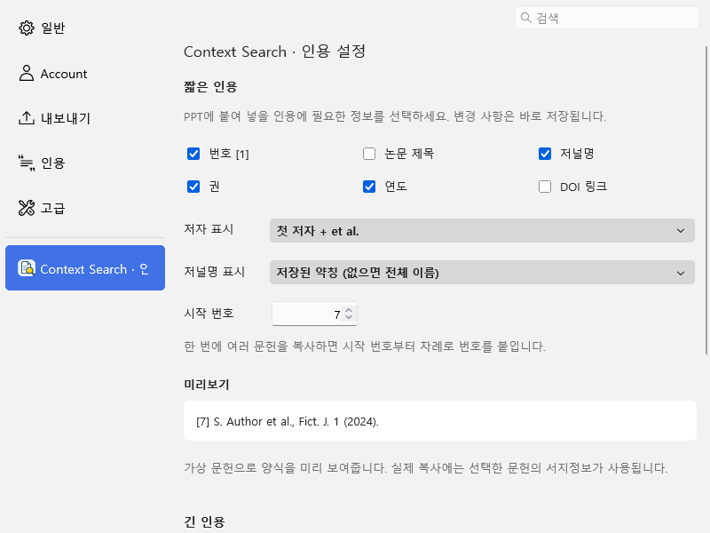

# Zotero Context Search

Zotero의 기존 검색창에서 서지정보와 색인된 PDF 본문을 검색하는 데스크톱 플러그인입니다. 일치한 문장의 앞뒤 내용과 PDF 페이지를 표시하며, 즐겨찾기와 인용 복사를 제공합니다.

[English](README.md) · [v1.0.0 다운로드](https://github.com/git-jiwon/zotero-context-search/releases/tag/v1.0.0) · [보안](SECURITY.md) · [개인정보](docs/PRIVACY.md)



화면과 인용 미리보기에는 가상의 논문·저자·저널과 예시용 DOI를 사용했습니다. 개인 서재 데이터는 포함하지 않았습니다.

## 주요 기능

- **본문 문맥 검색:** 제목·저자·태그·초록·노트와 기존 PDF 색인을 검색합니다. 결과마다 제목 → 저자 → 연도·저널명을 표시하고, 검색어가 있는 구간을 최대 세 곳 강조합니다.
- **PDF 페이지 표시·이동:** 기존 추출 텍스트 캐시에서 위치를 확인할 수 있으면 `PDF p. 3`, `PDF pp. 3–4`처럼 페이지나 범위를 표시합니다. 페이지 표시를 클릭하면 Zotero PDF 리더에서 첫 일치 페이지로 이동합니다.
- **기존 검색창 사용:** 입력하면 중앙 목록에 결과가 표시되고, 오른쪽 ×로 검색어를 지우면 기본 서지목록으로 돌아갑니다. 컬렉션·태그로 선택한 범위에서 검색합니다.
- **문헌 열기:** 검색 결과의 제목을 클릭하면 해당 첨부파일을 엽니다. ‘서지목록에서 보기’를 누르면 기존 정렬을 유지하면서 해당 문헌을 선택하고 목록 화면의 위쪽으로 이동합니다.
- **정확도·추가일 정렬:** 제목의 전체 문구 일치를 먼저 표시합니다. 최근 추가순 버튼을 다시 누르면 오래된 추가순으로 전환됩니다. 추가일은 상위 서지를 Zotero에 넣은 날짜입니다.
- **즐겨찾기 별:** 기본 목록과 검색 결과에서 별을 클릭합니다. 기존 `★` 태그로 저장하므로 Zotero 데이터 동기화를 이용할 수 있습니다.
- **인용 복사:** 짧은 인용의 번호·저자·제목·저널명·권·연도·DOI를 설정하고 미리보기로 확인합니다. 긴 인용은 Zotero의 빠른 복사 스타일 또는 짧은 양식에 모든 저자와 제목을 추가한 형식을 선택합니다.
- **원본 파일 복사:** 문헌을 우클릭해 저장된 첨부파일을 복사합니다. Windows에서는 여러 파일을 함께 복사할 수 있습니다.

## 설치

1. [Releases](https://github.com/git-jiwon/zotero-context-search/releases/tag/v1.0.0)에서 `zotero-context-search-1.0.0.xpi`를 내려받습니다.
2. Zotero의 **도구 → 플러그인 → 톱니바퀴 → 파일에서 플러그인 설치**를 선택합니다.
3. 내려받은 XPI를 선택합니다.
4. 별 열이 보이지 않으면 목록의 열 제목을 우클릭하고 즐겨찾기 열을 켭니다. 열은 원하는 위치로 옮길 수 있습니다.

설치 허용 범위는 **Zotero 9.0 이상**입니다. 실제 앱 검증은 **Windows의 Zotero 10.0.5**에서 수행했습니다. Zotero 9·macOS·Linux와 향후 주요 버전은 별도 실행 검증이 필요합니다.

## 화면 언어

플러그인을 시작할 때 Zotero의 앱 언어 설정을 따릅니다. 한국어 설정에서는 한국어, 영어 설정에서는 영어로 표시하며, 다른 언어에서는 영어를 사용합니다. 검색 버튼·즐겨찾기·인용 설정·메뉴·안내 메시지 전체에 적용됩니다. Zotero 언어를 바꾼 뒤에는 Zotero를 다시 시작하세요. 서지정보와 CSL 인용 스타일의 언어는 바뀌지 않습니다. 페이지 표시는 두 언어에서 모두 `PDF p. 3`, `PDF pp. 3–4` 형식을 사용합니다.

## 인용 설정

**Zotero 설정 → Context Search · 인용 설정** 또는 검색 상단의 **인용 설정**을 엽니다.

기본 짧은 인용 양식을 가상 서지정보로 표시한 예입니다.

```text
[1] S. Author et al., Fict. J. 1 (2024). https://doi.org/10.0000/example-article
```

여러 문헌을 복사하면 지정한 시작 번호부터 순서대로 번호가 붙습니다. PPT의 기존 인용 번호와 자동으로 연결되지는 않습니다. 저장된 서지정보만 사용하며 DOI나 저널 약어를 외부에서 조회하지 않습니다.

긴 인용의 **Zotero 양식**은 **설정 → 내보내기 → 빠른 복사**에 지정된 CSL 스타일을 사용합니다. **짧은 인용 설정 따라가기**는 짧은 양식에 모든 저자와 논문 제목을 포함합니다.



## 검색·동기화 범위

- 본문 검색 범위는 Zotero가 이미 색인한 범위까지입니다. 별도 AI 모델·임베딩·OCR·재색인을 실행하지 않습니다.
- PDF 본문 미리보기에는 Zotero의 추출 텍스트 캐시가 필요합니다. 캐시가 없으면 문맥을 표시하지 못할 수 있습니다.
- 페이지 번호는 PDF 파일의 물리적 페이지 순서이며, 문서에 인쇄된 쪽 번호와 다를 수 있습니다. 페이지 정보를 알 수 없거나 캐시 통계가 맞지 않으면 **PDF 본문**으로 표시합니다. 페이지를 추정하거나 PDF를 다시 분석하지 않습니다.
- 즐겨찾기는 정확한 `★` 태그만 사용합니다. 다른 별 모양 태그를 변환하지 않습니다.
- 각 PC에 플러그인을 설치해야 추가 UI를 사용할 수 있습니다. 웹·모바일 Zotero에 이 화면을 추가하지 않습니다.
- 인용 설정과 정렬 방식은 PC별로 저장됩니다. PDF·추출 텍스트·태그의 동기화는 Zotero의 기존 설정을 따릅니다.
- 페이지 표시를 클릭하면 Zotero PDF 리더로 이동합니다. 파일 열기와 다운로드는 Zotero의 기존 기능과 동기화 설정을 따릅니다.

## 원본 파일 복사

상위 문헌을 선택하면 Zotero의 PDF 우선 순서에서 현재 접근 가능한 첫 첨부파일을 복사합니다. 특정 보충자료는 그 첨부파일 자체를 선택하세요. 파일이 없으면 안내하며 자동 다운로드하지 않습니다. 연결 파일은 로컬 드라이브뿐 아니라 OS에서 접근 가능한 네트워크 드라이브에 있을 수도 있습니다.

원본을 수정하거나 이동하지 않으며, 주석을 합친 새 PDF를 만드는 기능도 아닙니다. 실제 OS 붙여넣기는 자동 검증 범위에 포함하지 않았습니다.

## 개발과 검증

[개발 안내](CONTRIBUTING.md) · [검증 기록](docs/VERIFICATION.md) · [보안 점검](docs/SECURITY_REVIEW.md)

이 프로젝트는 Zotero의 공식 제품이 아닌 독립 플러그인입니다. [MIT License](LICENSE).
