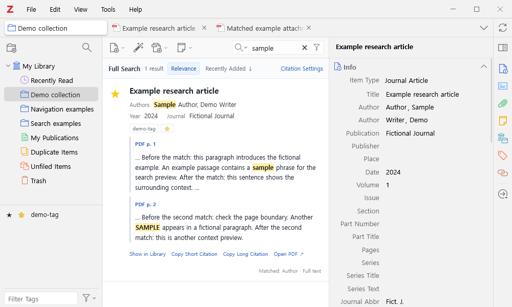
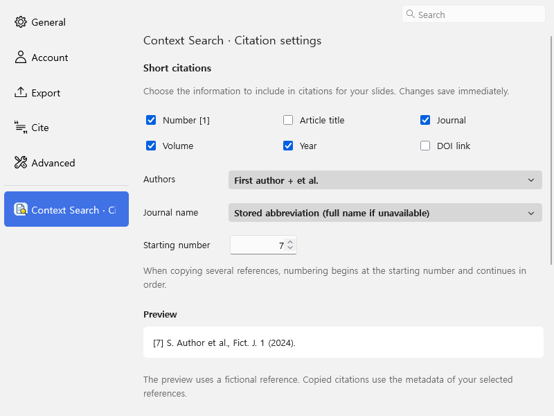

# Zotero Context Search

Search Zotero metadata and indexed PDF text from the existing search box. Results show matching passages, PDF page locations, and bibliographic details. The plugin also provides favorites and configurable citation copying.

[한국어 안내](README.ko.md) · [Download v1.0.0](https://github.com/git-jiwon/zotero-context-search/releases/tag/v1.0.0) · [Security](SECURITY.md) · [Privacy](docs/PRIVACY.md)



Screenshots and citation previews use fictional articles, authors, journals, and a placeholder DOI. They contain no personal library data.

## Features

- **Search with context.** Match titles, authors, tags, abstracts, notes, and Zotero's existing full-text index. Read up to three highlighted excerpts with surrounding text.
- **Open the matching PDF page.** PDF excerpts show the physical page number or range, such as `PDF p. 3` or `PDF pp. 3–4`, when Zotero's existing text cache supports a reliable mapping. Click the page label to open Zotero's PDF reader at the first matching page.
- **Use the existing search box.** Results appear in the central pane. Clear the query to return to the regular item list, keeping the current collection and tag scope.
- **Open a reference.** Click its title to open the matching attachment. Use **Show in Library** to select it near the top of the native list viewport, keeping your current sort order.
- **Choose the order.** Rank full phrases first, or sort by the bibliographic item's date added. Click the date button again to reverse the order.
- **Star references.** Click a bright yellow star in the native item list or search results. Favorites use the existing `★` tag and Zotero's normal data sync.
- **Copy short or long citations.** Configure numbering, authors, title, journal, volume, year, and DOI. Long citations use Zotero's Quick Copy CSL style or include all authors and the title in the short format.
- **Copy original files.** Copy an accessible attachment from the item context menu. Windows supports copying several files together.

No AI service, model, embeddings, or separate persistent search index is required.

## Install

1. Download `zotero-context-search-1.0.0.xpi` from [Releases](https://github.com/git-jiwon/zotero-context-search/releases/tag/v1.0.0).
2. In Zotero, open **Tools → Plugins → gear menu → Install Plugin From File**.
3. Select the downloaded XPI.
4. If the star column is hidden, right-click the item-list headers and enable favorites.

**Installation range:** Zotero 9.0 and later. **Runtime tested:** Zotero 10.0.5 on Windows. Zotero 9, macOS, Linux, and future major versions require separate runtime verification.

## Interface language

The interface follows Zotero's application language setting at startup: Korean uses Korean, English uses English, and other languages use English. Search controls, favorites, citation settings, menus, and messages are translated. Restart Zotero after changing its language setting. Bibliographic metadata and the citation style's CSL language remain unchanged. Both interfaces use `PDF p. 3` and `PDF pp. 3–4` for page labels.

## Citations

Open **Zotero Settings → Context Search · Citation settings** or **Citation Settings** above search results. Changes save immediately on this computer.

The default short format, shown with fictional metadata, is:

```text
[1] S. Author et al., Fict. J. 1 (2024). https://doi.org/10.0000/example-article
```

Multiple references are numbered from the configured starting number. Journal abbreviations and DOIs come from stored metadata. Slide numbering is not linked to PowerPoint.

Long citations either follow **Settings → Export → Quick Copy**, including the selected CSL style's formatting and numbering, or use the short format with all authors and the paper title.



## Data and limitations

- Search covers text already indexed by Zotero. This plugin does not extract PDFs, run OCR, or reindex. PDF previews require an accessible extracted-text cache.
- PDF page numbers refer to the file's physical pages, which can differ from printed page labels. Missing page information or inconsistent cache statistics show **PDF text** instead of a page number; the plugin does not guess a location or parse the PDF again.
- Favorites use exactly `★`. Other star glyphs are not migrated. The tag remains after uninstalling.
- Install on each desktop computer. The plugin does not add this UI to Zotero web or mobile apps. Citation settings and sort preferences are local to each computer.
- Original-file copy selects one accessible attachment per parent, preferring PDFs. Selecting a particular attachment copies that file. Missing files are not downloaded by the copy command.
- Linked attachments may be on network drives. Opening PDFs can use Zotero's existing download/sync settings. Release update checks contact GitHub. See [Privacy](docs/PRIVACY.md).
- Operating-system paste, cross-device sync, and combinations with other plugins are not covered by automated tests. Current package checks and platform limits are recorded in [Release verification](docs/VERIFICATION.md).

## Development

No runtime npm dependencies are required. Build with Python's standard library and run unit tests with Node.js:

```sh
node --test tests/*.test.cjs
python -m unittest discover -s tests -p '*_test.py'
python scripts/build.py
```

[Contributing and local tests](CONTRIBUTING.md) · [Release verification](docs/VERIFICATION.md) · [Security review](docs/SECURITY_REVIEW.md) · [Changelog](CHANGELOG.md)

Independent community plugin; not an official Zotero product. [MIT License](LICENSE).
